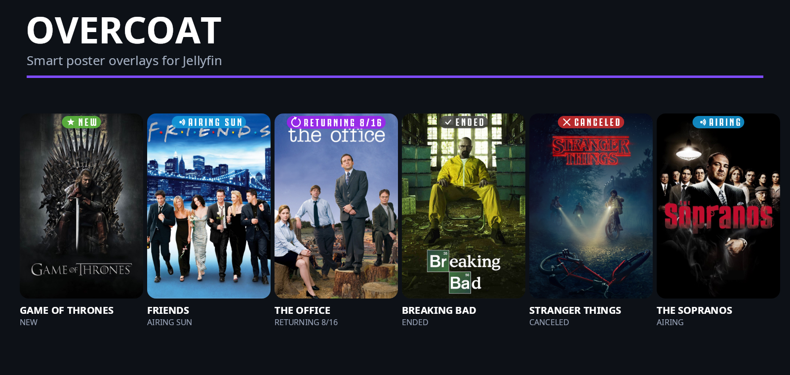
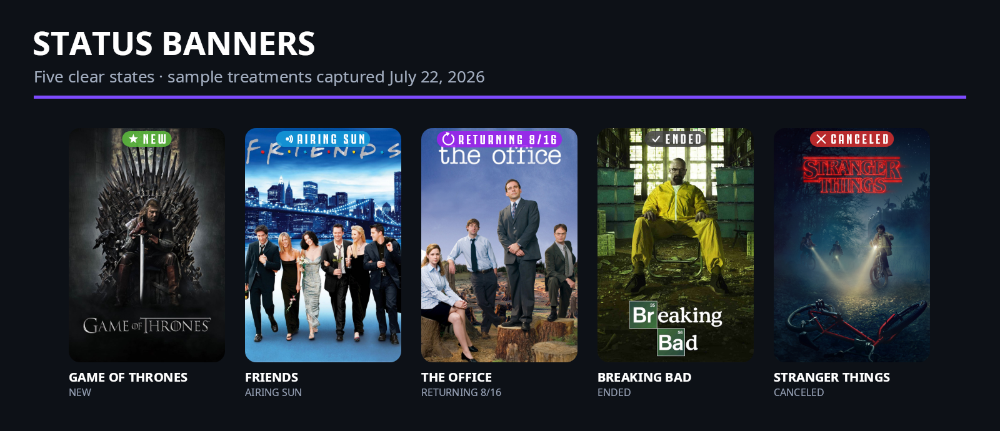
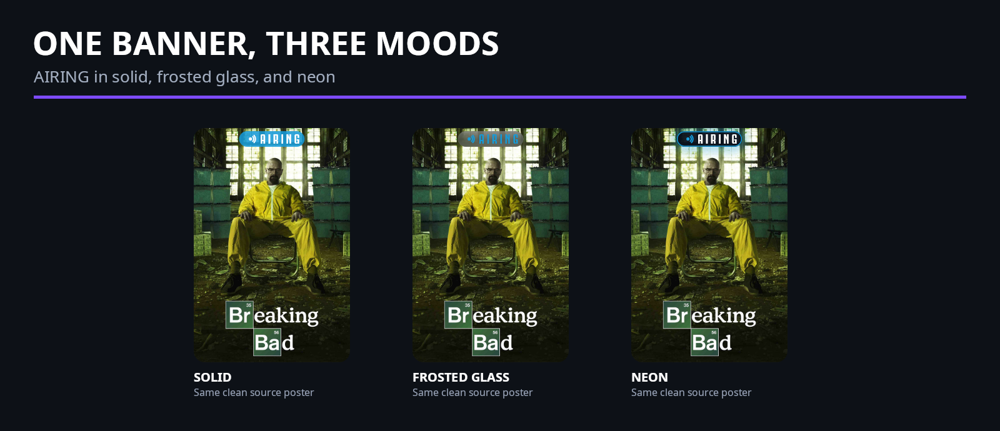
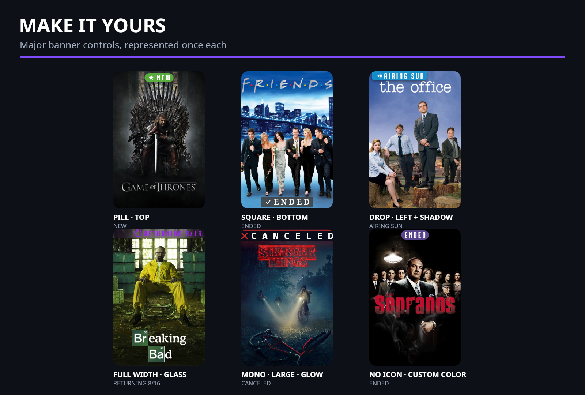
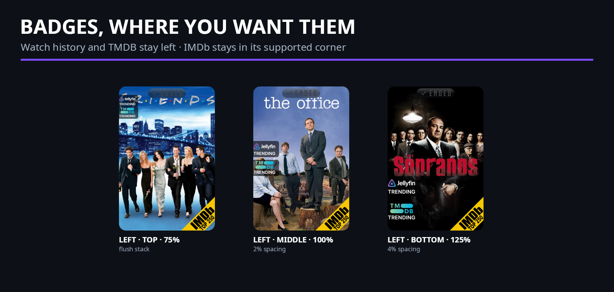
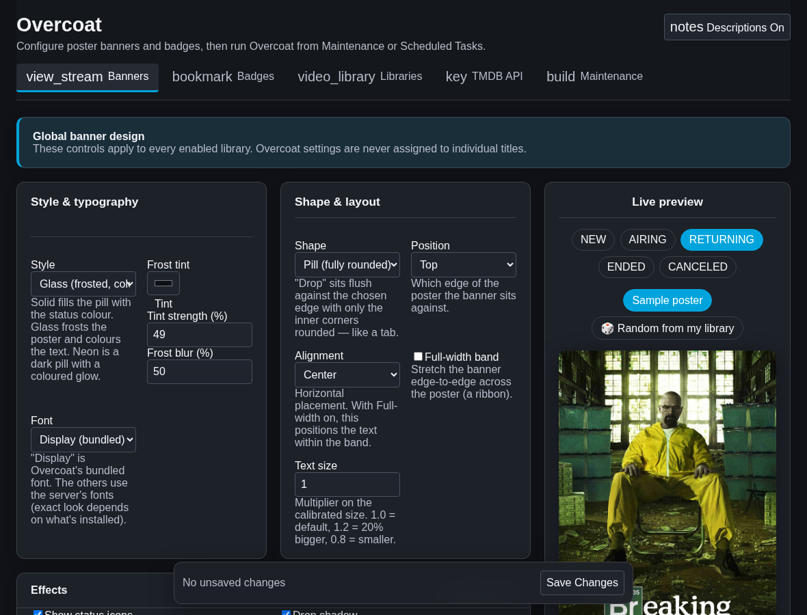
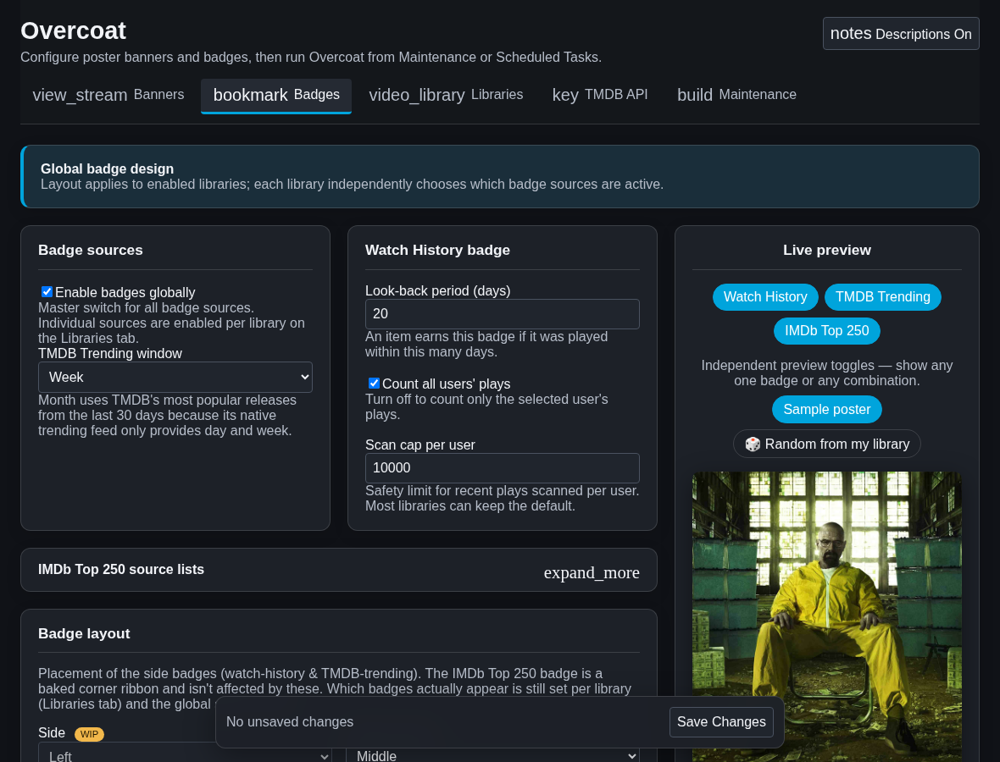
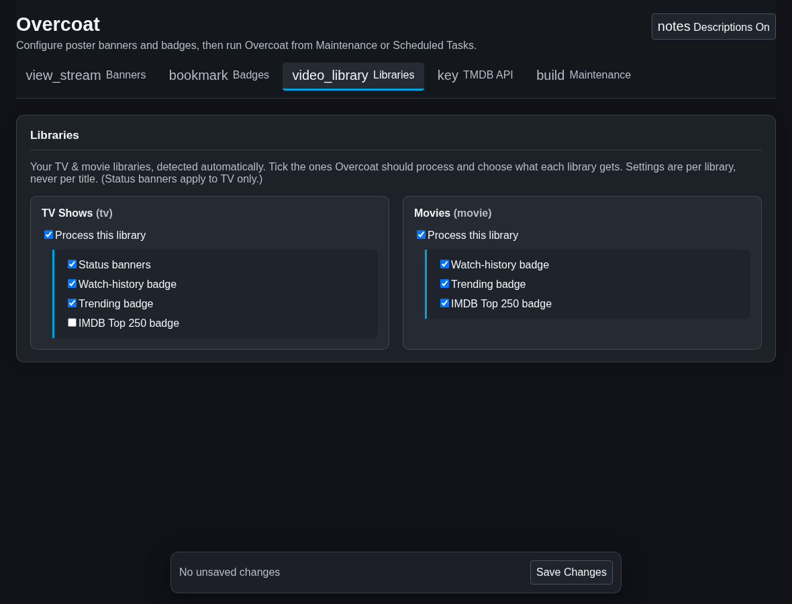
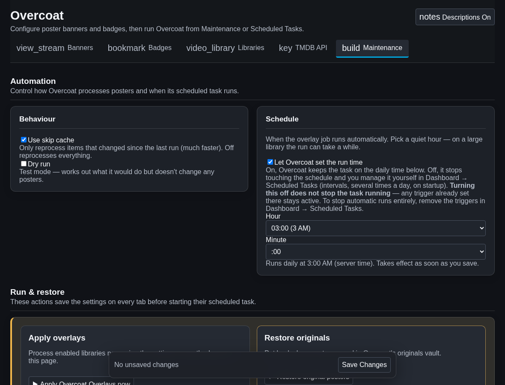

<div align="center">



# Overcoat

**Status banners and badges that make a Jellyfin library readable at a glance.**

[](https://github.com/clm302002/jellyfin-plugin-overcoat/releases/latest)
[](https://github.com/clm302002/jellyfin-plugin-overcoat/actions/workflows/ci.yml)
[](https://jellyfin.org/)
[](LICENSE)

</div>

Overcoat is a native Jellyfin plugin that draws useful information directly onto poster artwork. It
handles TV status banners, watch-history and TMDB Trending ribbons, and IMDb Top 250 corner badges;
each selected library can have its own combination. The project was heavily inspired by **Kometa**
and its approach to making media libraries more expressive and useful.

## See Overcoat in action



> The posters above are a visual-treatment showcase, not claims about those titles' current status.
> The banner examples were captured on **July 22, 2026**. Real labels are resolved from current
> metadata when Overcoat runs; schedules and return dates can change.







### What gets changed?

- **Banners** show `NEW`, `AIRING <day>`, `RETURNING <date>`, `ENDED`, or `CANCELED` on TV posters.
- **Badges** can show Jellyfin watch history, TMDB Trending membership, and IMDb Top 250 membership.
  Watch history means recent playback activity; it is not another “trending” source.
- **Poster safety:** Overcoat saves a clean original in its originals vault before writing an
  overlay. Dry-run mode lets you inspect what would be processed without changing posters.

> [!WARNING]
> Overcoat writes overlays into your poster artwork. Keep normal backups, and run **Restore Original
> Posters** before uninstalling. Uninstalling the plugin does not automatically restore posters.

## Install and get your first result

1. In Jellyfin, open **Dashboard → Plugins → Repositories**, select **+**, and add:

   ```text
   Name: Overcoat
   URL:  https://github.com/clm302002/jellyfin-plugin-overcoat/releases/latest/download/manifest.json
   ```

2. Open **Catalog**, install **Overcoat**, and restart Jellyfin.
3. Open **Dashboard → Plugins → Overcoat**. Add a free TMDB API key and select your libraries.
4. Start conservatively: enable **Dry run**, save, then use **Maintenance → Run now**.
5. Review the Overcoat log. Disable dry run and run **Apply Overcoat Overlays** again when ready.
6. Under **General → Schedule**, choose **Let Overcoat set the run time**, or turn it off and manage
   the task's triggers yourself in **Dashboard → Scheduled Tasks**.

Overcoat normally runs once daily. Choose a time after anything else that refreshes poster artwork;
a later library scan or metadata tool can replace an overlaid poster until Overcoat runs again.

## Customize it

The Banners tab covers solid, frosted-glass, and neon styles; pill, square, and edge-drop shapes;
top/bottom placement; alignment; full-width bands; bundled/system fonts; text scale; icons; shadows;
per-status colours and labels; glass blur/tint; neon glow; and airing/returning date formats. The
edge-flush **drop** shape is the maintainer's favorite and is featured in the customization gallery.

> [!IMPORTANT]
> Banner appearance and badge layout are **global settings**, not per-title settings. The Libraries
> tab chooses which overlay and badge types each library receives; every eligible title in that
> library then uses the same global appearance and layout. You can enable watch history only, TMDB
> Trending only, both side ribbons, and/or IMDb Top 250 for a library, but you cannot give one title
> a unique banner or badge design.

The Badges tab keeps badge sources and layout together: the global switch, day/week/month TMDB
window, watch-history rules, IMDb source lists, left-side ribbon anchor, scale, and spacing. IMDb
retains its supported corner placement. The gallery intentionally contains no right-side ribbon
examples because the current ribbon artwork is designed for the left edge. A random library poster
selected in either live preview stays in place while you edit or switch between Banners and Badges;
it changes only when you explicitly request another random poster.

### Settings tour

Click any screenshot to open the full-size image.

<p align="center">
  <a href="assets/settings-ui-v072-banners.png"></a>
  <a href="assets/settings-ui-v072-badges.png"></a>
  <a href="assets/settings-ui-v072-libraries.png"></a>
  <a href="assets/settings-ui-v072-maintenance.png"></a>
</p>

These are separate full-size captures of the real embedded configuration HTML in a standalone
mocked shell. Every user, library, configuration value, preview response, and access token is
synthetic. The capture tool has no real server address or API key, never logs in to Jellyfin, and
never contacts a live server.

Libraries expose their banner and badge choices only while **Process this library** is enabled. The
Maintenance tab groups normal processing, scheduling, apply/restore actions, vault recovery, and
advanced title targeting into separate sections.

## Compatibility and project status

| Area | Status |
| --- | --- |
| Jellyfin | **10.11.9 or newer**; 10.11.0–10.11.8 lack APIs the plugin needs |
| Runtime | .NET 9, supplied by a compatible Jellyfin server |
| TV status banners and live preview | Working |
| TV and movie badges | Working; movies are badges-only |
| Per-library controls | Working |
| Originals vault, dry run, restore task | Working |
| Badge art/style selection | Planned |

A TMDB API key is required for status and TMDB-backed lists. Overcoat is tested against the pinned
Jellyfin 10.11 API surface; newer Jellyfin releases may require a plugin update.

### Restoring or removing Overcoat

1. Stop tools or scans that might rewrite posters.
2. Run **Plugins → Overcoat → Maintenance → Restore original posters** (or the identically named
   scheduled task) and let it finish.
3. Verify a few posters, then uninstall the plugin and restart Jellyfin.

The originals vault and configuration live outside the versioned install directory and may survive
an uninstall. That persistence is useful for recovery, but it is not a substitute for your backups.

<details>
<summary><strong>Optional beta channel</strong></summary>

Add `https://github.com/clm302002/jellyfin-plugin-overcoat/releases/download/beta/manifest.json`
as a separate plugin repository. Betas are opt-in and never appear at the stable URL. The beta feed
also contains stable releases, so it can be used alone. Jellyfin sorts the four-part beta version
(for example `0.7.0.1`) above the matching stable (`0.7.0.0`); choose stable manually when moving
back from a beta. Keep backups and expect prerelease rough edges.

</details>

<details>
<summary><strong>Build from source</strong></summary>

Install the .NET 9 SDK, then run:

```bash
dotnet build Jellyfin.Plugin.Overcoat/Jellyfin.Plugin.Overcoat.csproj -c Release
```

For a normal installation, prefer the repository manifest: the release package includes matching
metadata and follows Jellyfin's update flow. Developer and release details are in
[CONTRIBUTING.md](CONTRIBUTING.md).

</details>

## A candid note about the project

Overcoat began as a vibe-coded tool for the maintainer's own server, and AI has assisted its
development. It remains a hobby project used in a real library—not a promise that poster mutation is
risk-free. Release builds and automated tests run in CI, the settings HTML has a dedicated checker,
and dry-run/restore paths are part of the normal workflow. Backups and careful first runs still
matter. Bug reports, test results, and code review from the community are welcome.

## Contributing

Issues, overlay designs, documentation fixes, and pull requests are welcome. Start with
[CONTRIBUTING.md](CONTRIBUTING.md). Please include the Overcoat log and mention any other software
that touches posters when reporting disappearing or replaced overlays.

## If something goes wrong

Overcoat saves a clean copy of every poster before it overlays it, and **those copies survive
uninstalling the plugin** — they live outside the plugin's own folder. So most mistakes are
recoverable.

**Settings → Maintenance → Recovery** shows how many of your posters can still be put back, and
flags any that have no saved copy.

| Situation | What to do |
| --- | --- |
| One poster looks wrong | In Jellyfin, refresh that item's metadata with **Replace existing images**. Overcoat re-overlays it on the next run. |
| You want your original posters back | **Settings → Maintenance → Restore original posters.** It skips anything whose art changed outside Overcoat, so it won't overwrite work you did yourself — tick *Force restore* if you want it to anyway. |
| You uninstalled without restoring first | Reinstall Overcoat and run Restore. The saved copies are still there. |
| Recovery says some posters have **no saved copy** | Restore can't help those. Refresh that library's metadata in Jellyfin with **Replace existing images** to pull fresh artwork from your metadata providers. |

---

## Attribution and license

Showcase poster artwork is sourced from TVDB and remains copyright its respective studios and
distributors. TMDB, IMDb, Jellyfin, TVDB, and depicted titles do not endorse or sponsor this project.
See [THIRD_PARTY_NOTICES.md](THIRD_PARTY_NOTICES.md) for data-source, mark, artwork, font, and package
notices.

Overcoat is licensed under [GPL-3.0-only](LICENSE).
