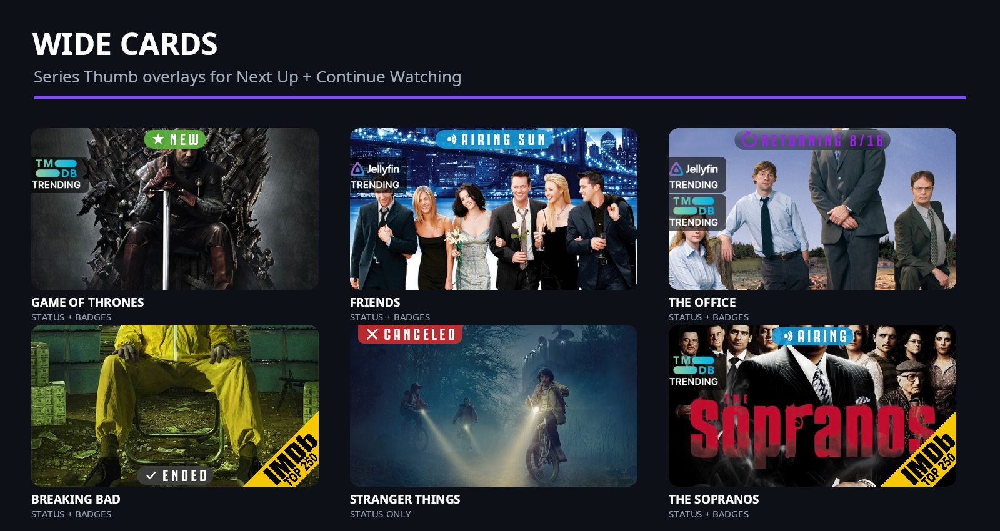

<div align="center">


# Overcoat

**Status banners and badges that make a Jellyfin library readable at a glance.**

[](https://github.com/clm302002/jellyfin-plugin-overcoat/releases/latest)
[](https://github.com/clm302002/jellyfin-plugin-overcoat/actions/workflows/ci.yml)
[](https://jellyfin.org/)
[](LICENSE)

</div>

Overcoat is a native Jellyfin plugin that draws useful information directly onto poster artwork. It
handles TV status banners, watch-history and TMDB Trending ribbons, and IMDb Top 250 corner badges;
each selected library can have its own combination. The project was heavily inspired by **Kometa**
and its approach to making media libraries more expressive and useful.

## See Overcoat in action


> The posters above are a visual-treatment showcase, not claims about those titles' current status.
> The banner examples were captured on **July 22, 2026**. Real labels are resolved from current
> metadata when Overcoat runs; schedules and return dates can change.


### Wide home cards (0.8 beta)



The optional 0.8 beta can apply the same overlays to a series' existing 16:9 **Thumb** artwork,
which Jellyfin can show in **Next Up** and **Continue Watching**. This is a work in progress under
live validation: only series Thumbs are eligible, series without a Thumb are skipped, and individual
episode images and Backdrops are never modified. The Libraries tab also includes confirmed actions
to make all current users inherit these wide cards, or return all current users to episode stills.

### What gets changed?

- **Banners** show `NEW`, `AIRING <day>`, `RETURNING <date>`, `ENDED`, or `CANCELED` on TV posters.
- **Badges** can show Jellyfin watch history, TMDB Trending membership, and IMDb Top 250 membership.
  Watch history means recent playback activity; it is not another “trending” source.
- **Poster safety:** Overcoat saves a clean original in its originals vault before writing an
  overlay. Dry-run mode lets you inspect what would be processed without changing posters.
- **Wide home cards (optional):** TV libraries can mirror overlays onto existing series Thumb art.
  Episode images and Backdrops remain untouched. The Libraries tab can set all current users to
  inherit these wide cards with one confirmed action, or switch everyone back to episode stills.
  This changes only Jellyfin's per-user display preference; run it again after adding a new user.
  Series without a Thumb are skipped.

> [!WARNING]
> Overcoat writes overlays into your poster artwork. Keep normal backups, and run **Restore Original
> Artwork** before uninstalling. Uninstalling the plugin does not automatically restore artwork.

## Install and get your first result

1. In Jellyfin, open **Dashboard → Plugins → Repositories**, select **+**, and add:

   ```text
   Name: Overcoat
   URL:  https://github.com/clm302002/jellyfin-plugin-overcoat/releases/latest/download/manifest.json
   ```

2. Open **Catalog**, install **Overcoat**, and restart Jellyfin.
3. Open **Dashboard → Plugins → Overcoat**. Add a free TMDB API key and select your libraries.
4. Start conservatively: enable **Dry run**, save, then use **Maintenance → Run now**.
5. Review the Overcoat log. Disable dry run and run **Apply Overcoat Overlays** again when ready.
6. Under **General → Schedule**, choose **Let Overcoat set the run time**, or turn it off and manage
   the task's triggers yourself in **Dashboard → Scheduled Tasks**.

Overcoat normally runs once daily. Choose a time after anything else that refreshes poster artwork;
a later library scan or metadata tool can replace an overlaid poster until Overcoat runs again.

## Customize it

The **Posters** tab keeps all poster banner and badge controls together: solid, frosted-glass, and
neon styles; pill, square, and edge-drop shapes; top/bottom placement; alignment; full-width bands;
bundled/system fonts; text scale; icons; shadows; per-status colours and labels; glass blur/tint;
neon glow; airing/returning date formats; plus badge sources (global switch, day/week/month TMDB
window, watch-history rules, IMDb source lists) and the left-side ribbon anchor, scale, and spacing.
The edge-flush **drop** shape is the maintainer's favorite. IMDb retains its supported corner
placement; the gallery has no right-side ribbon examples because the current ribbon artwork is
designed for the left edge.

The **Wide Cards** tab styles Jellyfin's landscape Next Up / Continue Watching cards **independently**
of posters. Turn on **Customize wide cards separately** and the wide-card banner style, shape,
position, size, and effects, plus badge placement/size, become their own settings — adjusting posters
never changes wide cards and vice-versa, each with its own live 16:9 preview. Left off (the default),
wide cards match your poster design exactly. Status colours, labels, which statuses/badges appear,
date formats, and badge sources are shared across both surfaces.

> [!IMPORTANT]
> Appearance is a **global setting per surface**, not a per-title setting. The Libraries tab chooses
> which overlay and badge types each library receives; every eligible title then uses the same global
> poster design (and wide-card design, if separately enabled). You can enable watch history only, TMDB
> Trending only, both side ribbons, and/or IMDb Top 250 for a library, but you cannot give one title a
> unique banner or badge design.

A random library image selected in any live preview stays in place while you edit or switch between
the Posters and Wide Cards tabs; it changes only when you explicitly request another random one.

### Settings tour

Click any screenshot to open the full-size image.

<p align="center">
  <a href="assets/settings-ui-v072-banners.png"></a>
  <a href="assets/settings-ui-v072-badges.png"></a>
  <a href="assets/settings-ui-v072-libraries.png"></a>
  <a href="assets/settings-ui-v072-maintenance.png"></a>
</p>

These are separate full-size captures of the real embedded configuration HTML in a standalone
mocked shell. Every user, library, configuration value, preview response, and access token is
synthetic. The capture tool has no real server address or API key, never logs in to Jellyfin, and
never contacts a live server.

Libraries expose their banner and badge choices only while **Process this library** is enabled. The
Maintenance tab groups normal processing, scheduling, apply/restore actions, vault recovery, and
advanced title targeting into separate sections.

The Libraries tab also reports how many current users see series wide cards versus episode stills.
**Use Overcoat wide cards for all current users** changes Jellyfin's Next Up/Continue Watching
preference so those users inherit the overlaid Series Thumb. **Use episode stills for all current
users** reverses that preference. Neither action changes, overlays, or deletes episode images.

## Compatibility and project status

| Area | Status |
| --- | --- |
| Jellyfin | **10.11.9 or newer**; 10.11.0–10.11.8 lack APIs the plugin needs |
| Runtime | .NET 9, supplied by a compatible Jellyfin server |
| TV status banners and live preview | Working |
| TV and movie badges | Working; movies are badges-only |
| Per-library controls | Working |
| Existing series Thumb wide-card overlays | Working; opt-in; episode images untouched |
| Originals vault, dry run, restore task | Working for posters and managed series Thumbs |
| Badge art/style selection | Planned |

Current prerelease: **v0.8.0-beta.3** (`0.8.0.3`) on the optional beta channel. It contains the
wide-card pipeline, the all-current-user artwork controls, and larger wide-card badges;
live-library validation is in progress.

A TMDB API key is required for status and TMDB-backed lists. Overcoat is tested against the pinned
Jellyfin 10.11 API surface; newer Jellyfin releases may require a plugin update.

### Restoring or removing Overcoat

1. Stop tools or scans that might rewrite posters.
2. Run **Plugins → Overcoat → Maintenance → Restore original artwork** (or the identically named
   scheduled task) and let it finish.
3. Verify a few posters, then uninstall the plugin and restart Jellyfin.

The poster vault (`originals/`), Series Thumb vault (`thumb-originals/`), their independent state
files, and the configuration live outside the versioned install directory and may survive an
uninstall. That persistence is useful for recovery, but it is not a substitute for your backups.

<details>
<summary><strong>Optional beta channel</strong></summary>

Add `https://github.com/clm302002/jellyfin-plugin-overcoat/releases/download/beta/manifest.json`
as a separate plugin repository. Betas are opt-in and never appear at the stable URL. The beta feed
also contains stable releases, so it can be used alone. Jellyfin uses the fourth version component
for channel ordering: betas count upward from `.1`, while the matching stable release uses `.500`
so every tester is offered the finished build. Keep backups and expect prerelease rough edges.

</details>

<details>
<summary><strong>Build from source</strong></summary>

Install the .NET 9 SDK, then run:

```bash
dotnet build Jellyfin.Plugin.Overcoat/Jellyfin.Plugin.Overcoat.csproj -c Release
```

For a normal installation, prefer the repository manifest: the release package includes matching
metadata and follows Jellyfin's update flow. Developer and release details are in
[CONTRIBUTING.md](CONTRIBUTING.md).

</details>

## A candid note about the project

Overcoat began as a vibe-coded tool for the maintainer's own server, and AI has assisted its
development. It remains a hobby project used in a real library—not a promise that poster mutation is
risk-free. Release builds and automated tests run in CI, the settings HTML has a dedicated checker,
and dry-run/restore paths are part of the normal workflow. Backups and careful first runs still
matter. Bug reports, test results, and code review from the community are welcome.

## Contributing

Issues, overlay designs, documentation fixes, and pull requests are welcome. Start with
[CONTRIBUTING.md](CONTRIBUTING.md). Please include the Overcoat log and mention any other software
that touches posters when reporting disappearing or replaced overlays.

## If something goes wrong

Overcoat saves a clean copy of every poster and Series Thumb before overlaying it, and **those copies
survive uninstalling the plugin** — they live outside the versioned install folder. Poster and Thumb
recovery are tracked independently, so restoring one image type cannot consume the other's backup.

**Settings → Maintenance → Recovery** reports poster and wide-card backups separately and flags any
managed image that has no saved copy.

| Situation | What to do |
| --- | --- |
| One poster looks wrong | In Jellyfin, refresh that item's metadata with **Replace existing images**. Overcoat re-overlays it on the next run. |
| You want your original artwork back | Run **Restore Original Artwork (Overcoat)**. It restores both managed posters and Series Thumbs, skips either image when it changed outside Overcoat, and keeps that backup for retry. Use *Force restore* only when the vaulted copy should win. |
| You uninstalled without restoring first | Reinstall Overcoat and run Restore. The saved copies are still there. |
| Recovery says an image has **no saved copy** | Restore cannot recover that image. Refresh the affected artwork from your metadata provider; do not replace episode images merely to repair a Series Thumb. |

---

## FAQ

**My movie or wide-card overlays disappear after a library scan.**
This is expected, and Overcoat handles it automatically. When a poster lives in your media folder
(common with the *arr apps, or hand-placed art), Jellyfin re-adopts that file on every library scan
and strips Overcoat's overlay off the affected items. Jellyfin does this unconditionally — there is no
setting to disable it, and it applies to *any* overlay tool, not just Overcoat. So Overcoat watches
for a scan to finish and **re-applies within about a minute**, touching only what the scan changed. If
you'd rather it didn't, turn off **Settings → Maintenance → Re-apply after a library scan**.

**Does Overcoat modify the posters in my media folders?**
No — never. Overcoat only writes to Jellyfin's own metadata folder and keeps a clean backup of every
image it overlays. Your media-folder artwork is never touched. (That's also why a scan can revert
overlays: Jellyfin prefers the untouched media-folder copy.)

**A manual scan of one library — does Overcoat re-do my whole library?**
No. A per-library scan triggers a follow-up on **just that library**. A full "Scan Media Library"
covers everything. Either way the run is cache-gated, so only items whose artwork actually changed are
re-rendered.

**Will all these saved copies fill up my disk?**
No. Overcoat keeps **one** clean copy per overlaid image and overwrites it in place — re-scanning and
re-overlaying the same items never adds more. Total backup size grows only with your library size, not
with how often things run. **Settings → Maintenance → Recovery** shows the current size.

**Overlays flicker off briefly during a scan.**
That's the gap between Jellyfin reverting an image and Overcoat re-applying (up to ~a minute after the
scan settles). It's cosmetic and resolves itself. Frequent flicker usually means very frequent library
scans — consider how often that task really needs to run.

---

## Attribution and license

Showcase poster artwork is sourced from TVDB and remains copyright its respective studios and
distributors. TMDB, IMDb, Jellyfin, TVDB, and depicted titles do not endorse or sponsor this project.
See [THIRD_PARTY_NOTICES.md](THIRD_PARTY_NOTICES.md) for data-source, mark, artwork, font, and package
notices.

Overcoat is licensed under [GPL-3.0-only](LICENSE).
