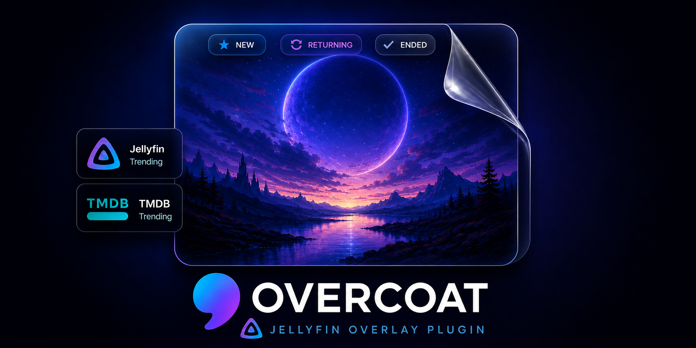
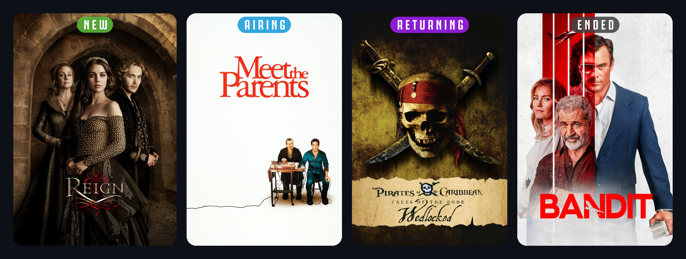
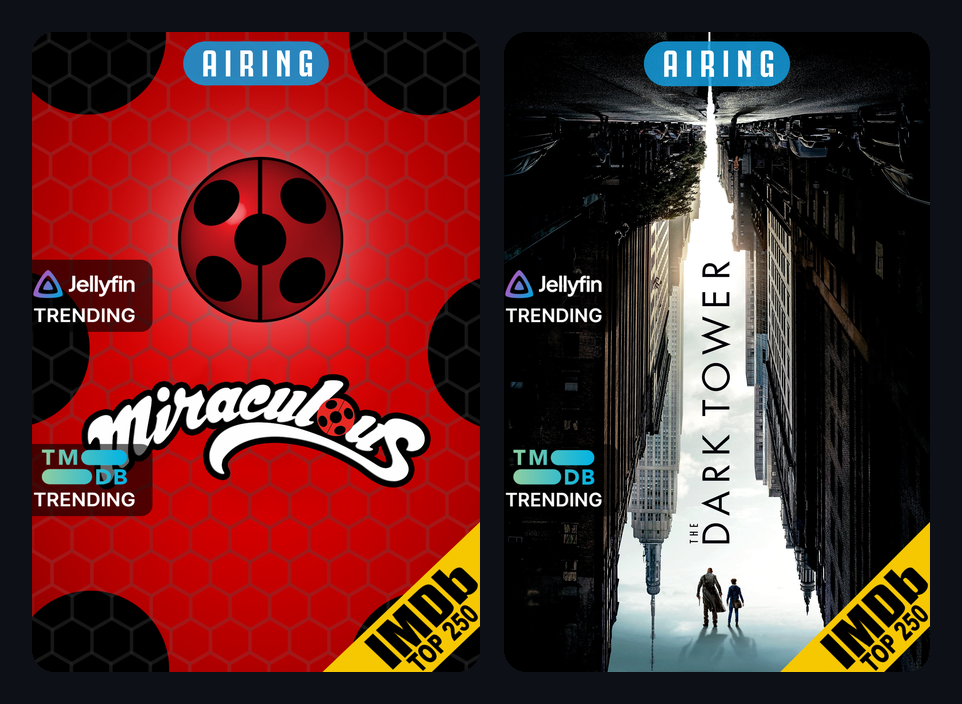

<div align="center">




**Smart poster overlays for Jellyfin.**

Overcoat adds clean status banners and badges directly to your Jellyfin posters — so your library can show what is **new**, **airing**, **returning**, **ended**, **canceled**, trending, ranked, or worth noticing at a glance.

Inspired by **Kometa**, built specifically for **Jellyfin**.

</div>

---

<div align="center">

## !!! Yes, this is vibe-coded !!!

</div>

Full transparency: I'm not a professional C#/Jellyfin developer — I built Overcoat for my own server,
mostly by "vibe coding" it with an AI assistant until it did what I wanted. I'm sharing it in case
someone else wants something similar.

It works and I use it daily, but treat it as a hobby project: expect rough edges, **back up anything
you care about**, and know that things may change. Bug reports, ideas, and pull requests are very
welcome — but no pressure, and no promises.

---

## What it does

Overcoat gives your Jellyfin library a polished, information-rich poster view without needing external scripts or manual poster edits.

It can add:

* **Top status banners**
  `NEW`, `AIRING`, `RETURNING`, `ENDED`, `CANCELED`

* **Side badges**
  `TMDB Trending` and watch-history (recently played) badges, and more

* **Corner badges**
  IMDb Top 250, ranking badges, and other compact poster markers

Everything is rendered into the poster artwork and saved through Jellyfin, so it appears naturally inside your library.

---

## Preview

<div align="center">


</div>

---

## Why Overcoat?

Jellyfin posters look great, but sometimes the most useful information is hidden behind clicks.

Overcoat makes that information visible immediately.

You can quickly spot:

* shows that are currently airing
* shows that are returning soon
* completed or canceled series
* trending titles
* highly ranked movies
* items with watch-history or activity badges

The goal is simple:

> Make your Jellyfin library easier to browse, prettier to look at, and more useful at a glance.

---

## Current status

Overcoat is early, but working.

The current focus is TV status overlays, with badges and movie overlays being actively built out.

| Area                    | Status      |
| ----------------------- | ----------- |
| TV status banners       | Working     |
| Banner customization    | Working     |
| Live banner preview     | Working     |
| TMDB Trending badge     | Working     |
| Watch-history badge      | Working     |
| IMDb Top 250 badge      | Working     |
| Movie overlays (badges) | Working     |
| Settings page           | Working     |
| Badge customization     | In progress |

---

## Features

* Native Jellyfin plugin
* Runs inside Jellyfin
* Uses Jellyfin scheduled tasks
* Per-library configuration
* Poster overlays rendered with SkiaSharp
* Status banners for TV series, with **solid / frosted-glass / neon** styles
* Banner **shape** (pill / square / drop), **position**, **full-width band**, alignment, drop shadow,
  font, text size, per-status colours, custom labels, and show/hide per status
* A **live preview** in the settings page — dial in the look without running anything
* Badge support for trending/ranked/watch-history metadata
* No cron jobs
* No separate upload server
* No manual poster editing

---

## Requirements

* Jellyfin **10.11.x**
* **.NET 9**
* A free **TMDB API key**

Additional metadata sources may be required for some badges as they are added.

---

## Installation

### Add the plugin repository (recommended)

In Jellyfin, go to **Dashboard → Plugins → Repositories**, click **+**, and add:

* **Repository Name:** `Overcoat`
* **Repository URL:**

  ```
  https://github.com/clm302002/jellyfin-plugin-overcoat/releases/latest/download/manifest.json
  ```

Then:

1. Open **Dashboard → Plugins → Catalog**, find **Overcoat**, and click **Install**.
2. **Restart Jellyfin.**
3. Open **Plugins → Overcoat**, add your TMDB API key, and choose which libraries to process.
4. Run the scheduled task: **Dashboard → Scheduled Tasks → Apply Overcoat Overlays**.

> ✅ Live now — `v0.2.0` is published, so the repository URL above works. (Prefer building it
> yourself? See **Build from source** below.)

---

## Build from source

Requires the **.NET 9 SDK**.

```bash
dotnet build Jellyfin.Plugin.Overcoat/Jellyfin.Plugin.Overcoat.csproj -c Release
```

Copy the built `Jellyfin.Plugin.Overcoat.dll` into a folder under Jellyfin's `plugins/` directory
(e.g. `plugins/Overcoat_0.2.0.0/`), restart Jellyfin, then configure it under **Plugins → Overcoat**.

---

## Roadmap

Planned work includes:

* Badge customization — styles, positioning, and selectable/custom badge art
* Add more badge sources
* Add better poster backup/restore behavior
* Add multi-poster selection
* Finish movie overlay support

Recently shipped: a full banner customization studio (styles, shape, colours, fonts, per-status
labels) with a live preview, and the first public repository release.

---

## Screenshots

<div align="center">



<br /><br />



</div>

---

## Inspiration

Overcoat is inspired by **Kometa** and the idea of turning a media library into something more visual, useful, and personalized.

This project is not affiliated with Jellyfin, Kometa, TMDB, TVDB, or IMDb.

---

## Contributing

Contributions, ideas, bug reports, and overlay designs are welcome.

See [CONTRIBUTING.md](CONTRIBUTING.md) for details.

---

## License

[GPL-3.0-only](LICENSE)
