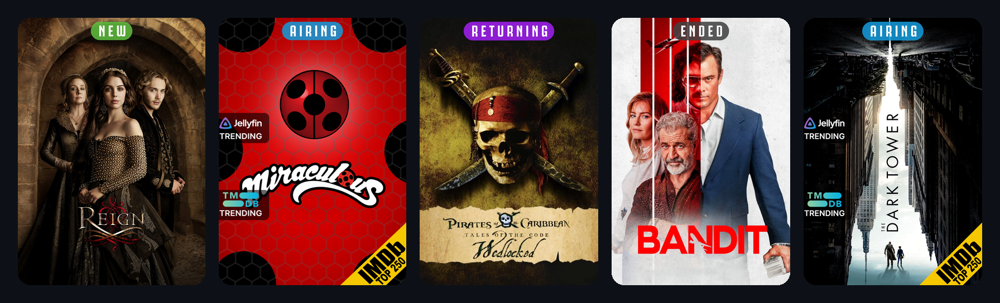

<div align="center">


**Smart poster overlays for Jellyfin.**

Overcoat adds clean status banners and badges directly to your Jellyfin posters — so your library can show what is **new**, **airing**, **returning**, **ended**, **canceled**, trending, ranked, or worth noticing at a glance.

Inspired by **Kometa**, built specifically for **Jellyfin**.

</div>

---

## What it does

Overcoat gives your Jellyfin library a polished, information-rich poster view without needing external scripts or manual poster edits.

It can add:

* **Top status banners**
  `NEW`, `AIRING`, `RETURNING`, `ENDED`, `CANCELED`

* **Side badges**
  `Jellyfin Trending`, `TVDB Trending`, watch-history badges, and more

* **Corner badges**
  IMDb Top 250, ranking badges, and other compact poster markers

Everything is rendered into the poster artwork and saved through Jellyfin, so it appears naturally inside your library.

---

## Preview

<div align="center">



</div>

---

## Why Overcoat?

Jellyfin posters look great, but sometimes the most useful information is hidden behind clicks.

Overcoat makes that information visible immediately.

You can quickly spot:

* shows that are currently airing
* shows that are returning soon
* completed or canceled series
* trending titles
* highly ranked movies
* items with watch-history or activity badges

The goal is simple:

> Make your Jellyfin library easier to browse, prettier to look at, and more useful at a glance.

---

## Current status

Overcoat is early, but working.

The current focus is TV status overlays, with badges and movie overlays being actively built out.

| Area                    | Status      |
| ----------------------- | ----------- |
| TV status banners       | Working     |
| Jellyfin Trending badge | In progress |
| TVDB Trending badge     | In progress |
| IMDb Top 250 badge      | In progress |
| Movie overlays          | In progress |
| Settings page polish    | Planned     |

---

## Features

* Native Jellyfin plugin
* Runs inside Jellyfin
* Uses Jellyfin scheduled tasks
* Per-library configuration
* Poster overlays rendered with SkiaSharp
* Status banners for TV series
* Badge support for trending/ranked/watch-history metadata
* No cron jobs
* No separate upload server
* No manual poster editing

---

## Requirements

* Jellyfin **10.11.x**
* **.NET 9**
* A free **TMDB API key**

Additional metadata sources may be required for some badges as they are added.

---

## Installation

> Overcoat is not fully released yet. Until the first tagged release is available, build from source.

Once a release is available:

1. Go to **Dashboard → Plugins → Repositories**
2. Add the Overcoat plugin repository URL
3. Install **Overcoat** from the plugin catalog
4. Restart Jellyfin
5. Open **Plugins → Overcoat**
6. Add your API keys and choose which libraries to process
7. Run the scheduled task: **Apply Overcoat Overlays**

---

## Build from source

```bash
dotnet build Jellyfin.Plugin.Overcoat/Jellyfin.Plugin.Overcoat.csproj -c Release
```

The compiled plugin DLL can be copied into Jellyfin’s plugin directory.

---

## Roadmap

Planned work includes:

* Finish movie overlay support
* Add badge stacking and positioning options
* Improve the settings page
* Add more badge sources
* Add better poster backup/restore behavior
* Add multi-poster selection
* Add preview tools before applying overlays
* Package the first public plugin repository release

---

## Screenshots

<div align="center">


<br /><br />


</div>

---

## Inspiration

Overcoat is inspired by **Kometa** and the idea of turning a media library into something more visual, useful, and personalized.

This project is not affiliated with Jellyfin, Kometa, TMDB, TVDB, or IMDb.

---

## Contributing

Contributions, ideas, bug reports, and overlay designs are welcome.

See [CONTRIBUTING.md](CONTRIBUTING.md) for details.

---

## License

[GPL-3.0-only](LICENSE)
